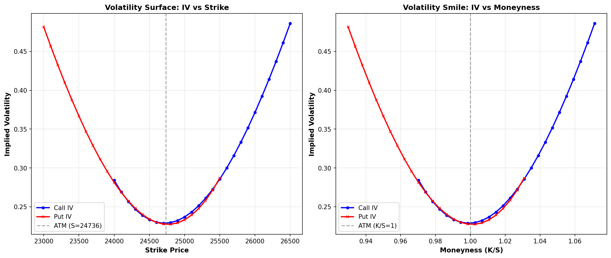

# Implied Volatility (IV) Prediction and Visualization

This project analyzes and visualizes the **Implied Volatility (IV)** structure for option prices — focusing on the _volatility smile_ and _volatility surface_. The notebook and supporting code estimate IV for call and put options, plot the IV curves, and interpret the results in terms of market moneyness.

---

## 🧮 Mathematical Foundation

### 1. Black–Scholes Model

Black–Scholes Option Pricing Formula (Non-Dividend Paying Asset):

Call Option: C = S0 _ N(d1) - K _ exp(-r _ T) _ N(d2)
Put Option: P = K _ exp(-r _ T) _ N(-d2) - S0 _ N(-d1)

Where:
d1 = (ln(S0 / K) + (r + 0.5 _ σ^2) _ T) / (σ _ sqrt(T))
d2 = d1 - σ _ sqrt(T)

Symbols:
C, P : Call and Put option prices
S0 : Current spot price of the underlying
K : Strike price
r : Risk-free interest rate
T : Time to maturity (in years)
σ : Implied volatility
N(x) : Cumulative normal distribution function

---

### 2. Implied Volatility (IV)

Implied Volatility (σimpl) is the value of σ that satisfies the Black–Scholes price given an observed market option price.

That is:

\[
C_market = BS_call(S\*0, K, r, T, σimpl)
\]

Since there is no closed-form solution for \( \sigma\_{impl} \), it is found **numerically** using iterative methods like:

- **Newton–Raphson**, or
- **Bisection Method**

---

### 3. Moneyness and the Volatility Smile

Moneyness is defined as:

\[
M = K/S0
\]

- **At-The-Money (ATM)**: \( M = 1 \)
- **In-The-Money (ITM)**: \( M < 1 \)
- **Out-of-The-Money (OTM)**: \( M > 1 \)

Empirically, IV tends to form a **U-shape** (called a _volatility smile_) when plotted against \( K \) or \( M \).

---

## Implementation Details

- **Language:** Python 3.10+
- **Environment:** Jupyter Notebook / VS Code
- **Core Libraries:**
  - `numpy` – mathematical operations
  - `pandas` – data loading and manipulation
  - `scipy.optimize` – for implied volatility root finding
  - `matplotlib` – plotting volatility surfaces and smiles

### Workflow:

1. Load input option chain data.
2. Compute IV for calls and puts via numerical root-finding.
3. Compute **moneyness (K/S)** and **strike-wise IV curves**.
4. Plot:
   - IV vs Strike
   - IV vs Moneyness (Smile)

---

## Results

The following plots visualize the **volatility surface** and **smile** structure:

**Interpretation:**

- IV is minimum at the _ATM strike_ and rises symmetrically for ITM/OTM options.
- The smile pattern implies **non-constant volatility**, contradicting the constant volatility assumption of Black–Scholes.
- This reflects **market sentiment** — deep ITM and OTM options are priced with higher IV due to tail risk.

---

## Possible Extensions

- Fit **parametric volatility surfaces** (SABR, Heston models).
- Train ML regressors (e.g., XGBoost or LSTM) for IV forecasting.
- Add 3D volatility surface visualization over time-to-expiry.

---
